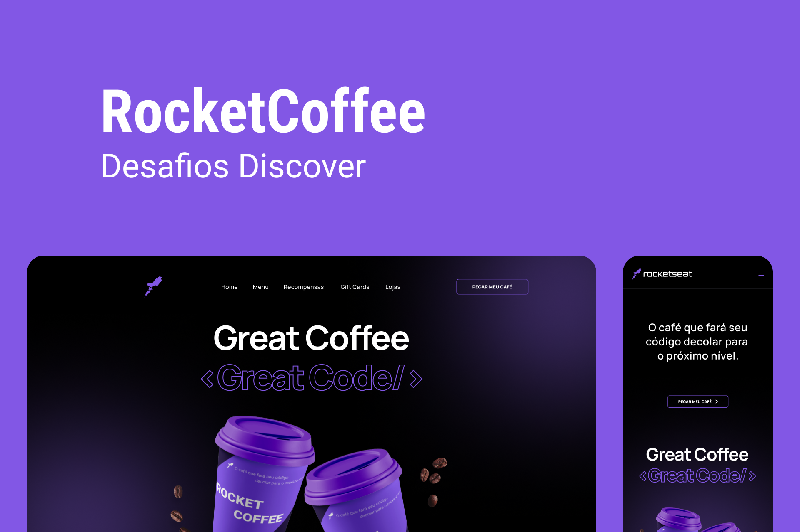

<h1 align="center">
  
</h1>

# ✅ **Requisitos**

---

Neste desafio foi proposto construir uma homepage para uma marca de café.

**Requisitos para o desafio:**

- Seguir o layout do Figma.

- Deixar o layout responsivo conforme o Figma.

- Na versão mobile, ao clicar no menu hamburger deverá exibir um menu responsivo conforme layout do Figma.

- Adicionar `hover` nos botões.

**_Se desafie também:_**

- Adicionando animações

# 🎨 Style Guide

---

## **Cores:**

```css
:root {
  --background: #000;
  --text-color: #fff;
  --button: #8257e5;
  --border: #29292e;
  --border-menu-mobile: #a8a8b3;
  --text-color-menu-mobile: #e1e1e6;
}
```

## **Tipo de fonte:**

font-family: Manrope

font-weight: 400, 500 e 700

Você pode encontrar a fonte no [Google Fonts](https://fonts.google.com/)

## **Template:**

O template do projeto está [aqui](https://www.figma.com/file/tFoovGllUttTebdUTDVdT8/RocketCoffee/duplicate).

Lembrando que para ver o layout você precisa ter uma conta no [figma](https://www.figma.com)
